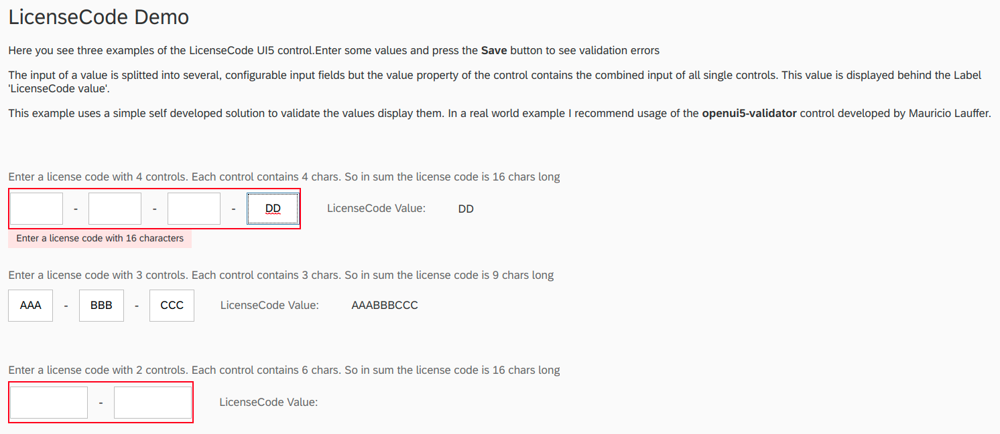

# openui5-licensecode_input

[](https://www.npmjs.com/package/openui5-licensecode_input)


An OpenUI5 library to enter a license code, registration code or ...

## Demo

You can check out a live demo here:

<https://htammen.github.io/openui5-licensecode_input/demo/webapp/index.html>



## Project Structure

* demo - Library's live demo
* dist - Distribution folder which contains the library ready to use
* src  - Development folder
* test - Testing framework for the library

## Getting started

### Installation

Install openui5-licensecode_input as an npm module

```sh
$ npm install openui5-licensecode_input
```

### Configure manifest.json

Add the library to *sap.ui5/dependencies/libs* and set its path in *sap.ui5/resourceRoots* in your manifest.json file, as follows:

```json
{
  "sap.ui5": {
    "dependencies": {
      "libs": {
        "openui5.licensecode_input": {}
      }
    },
    "resourceRoots": {
      "openui5.licensecode_input": "./FOLDER_WHERE_YOU_PLACED_THE_LIBRARY/openui5/licensecode_input/"
    }
  }
}
```

### How to use

Add openui5-licensecode to your UI5 view:

```xml
<mvc:View controllerName="htammen.demo.openui5.licensecode_input.controller.App" displayBlock="true"
          xmlns:mvc="sap.ui.core.mvc" xmlns:core="sap.ui.core" xmlns="sap.m"
          xmlns:license="openui5.licensecode_input">
    <Shell>
        <App>
            <Page title="{i18n>TITLE}">
                <content>
                    <VBox class="sapUiMediumMargin">
                        <FormattedText htmlText="{i18n>demo.description}"/>
                        <Label text="Enter a license code with 4 controls. Each control contains 4 chars. So in sum the license code is 16 chars long" class="sapUiLargeMarginTop"/>
                        <HBox alignItems="Center" alignContent="SpaceBetween">
                            <license:LicenseCode id="licenseCode0" 
                                value="{path: '/licenseCode0'}" 
                                valueStateText="Enter a license code with 16 characters">
                            </license:LicenseCode>
                            <Label text="LicenseCode Value:" vAlign="Bottom" class="sapUiResponsiveMargin"/>
                            <Text text="{path: '/licenseCode0'}" class="sapUiTinyMarginBeginEnd"/>
                        </HBox>
                    </VBox>
                </content>
                <footer>
                    <Toolbar>
                        <Button id="btMessagePopover" icon="sap-icon://message-popup" type="Reject"
                                visible="false" press="onMessagePopoverPress"/>
                        <ToolbarSpacer/>
                        <Button icon="sap-icon://save" text="Save" press="onSave" />
                    </Toolbar>
                </footer>
            </Page>
        </App>
    </Shell>
</mvc:View>

```

## Control Parameters

| Name | Type | Default| Description
| :---- | :------------------- | :---- | :---------  |
| value | string | null | Value of the control.
| valueState | sap.ui.core.ValueState | None | valueState of the controla
| valueStateText | string | null | Text to display under the control if validation of value failed
| controlCount | int | 4 | Number of inner controls (input fields) to display and use for this control
| singleControlLength | int | 4 | Length of each inner control (input field). Means: how many characters are allowed in each input field 

## Author

Helmut Tammen

## License

This project is licensed under the MIT License - see the [LICENSE](LICENSE) file for details
